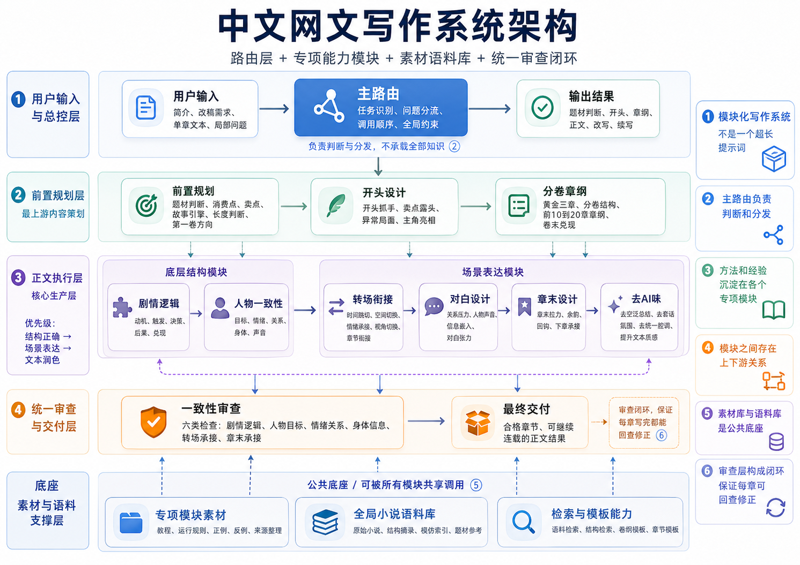
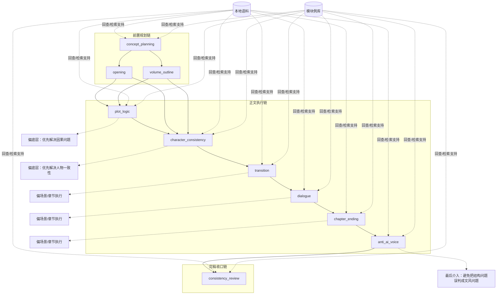

# Chinese-WebNovel-Skill

[](https://socialistic.ai/zh/skill/chinese-webnovel-skill-db2a48?utm_source=github&utm_medium=readme_badge)

这是一个面向中文网文写作的 Codex skill。

它现在的核心不是一份很长的总 prompt，而是一套 `主 skill 路由 + 专项模块下沉 + 本地语料检索` 的模块化设计。

知乎回答贴: [为什么很多网文作者都非常自信，认为AI在创作领域无法取代自己？](https://www.zhihu.com/question/1914316923497350507/answer/2033351363309065828)


## 设计思路

这套 skill 主要分四层：

1. `SKILL.md`
   只保留全局原则、流程约束和模块路由，不再把所有写作知识堆在一个文件里。
2. `references/modules/`
   每个高频问题拆成独立模块，单独处理教程、运行规则、正例、反例。
3. `data/ + analysis/`
   提供本地小说语料、结构摘录和检索索引，支持“先匹配素材，再构思，再写作”。
4. `scripts/ + templates`
   提供检索脚本和少量模板资产，把模块判断进一步落成可执行动作。

这样做的目的很简单：

- 主 skill 保持短、稳、可维护
- 具体问题用具体模块处理
- 模型先诊断问题层级，再调用对应材料
- 避免一个巨型 prompt 同时兼顾开头、转场、对白、逻辑、审查，最后全部变钝

## 架构图

下面这张图对应当前版本的整体产品架构，展示了路由层、专项模块、语料底座和统一审查闭环之间的关系。



## 当前模块

当前已接入这些专项模块：

- `concept_planning`
- `opening`
- `transition`
- `dialogue`
- `chapter_ending`
- `plot_logic`
- `character_consistency`
- `consistency_review`
- `volume_outline`
- `anti_ai_voice`

模块总入口：
[references/modules/README.md](references/modules/README.md)

每个模块默认都按同一套结构组织：

- `README.md`
- `tutorial.md`
- `runtime.md`
- `good_examples.md`
- `bad_examples.md`
- `source_index.md`

个别模块会额外附带模板资产，例如 `volume_outline` 下的卷纲和章纲模板。

## 模块职责总览

- `concept_planning`
  作用：把一句简介压成题材、消费点、hook、premise、故事引擎、长度判断和第一卷方向。
  位置：最上游的前置规划模块，决定“值不值得写、该怎么开”。
- `opening`
  作用：把卖点、异常局面和主角亮相落到前 300-3000 字，解决开头成交问题。
  位置：承接 `concept_planning`，负责把骨架变成能抓人的开篇。
- `volume_outline`
  作用：把故事引擎展开成黄金三章、分卷设计、前 10-20 章章纲和卷末兑现。
  位置：承接 `concept_planning`，负责中长线结构。
- `plot_logic`
  作用：修动机、触发、决策、后果、兑现这条因果链。
  位置：正文执行层的底层结构模块，优先级高于纯文风问题。
- `character_consistency`
  作用：修目标、情绪、关系、身体、声音五类人物连续性。
  位置：正文执行层的人物状态模块，负责“这个人还是不是这个人”。
- `transition`
  作用：处理时间跳切、空间切换、情绪承接、视角切换和章末接下章。
  位置：正文执行层的场景桥梁模块，负责“场和场怎么接住”。
- `dialogue`
  作用：处理关系压力、人物声音、信息嵌入和对白刀口。
  位置：正文执行层的表达模块，但不只是文风，而是关系和利益的对话结构。
- `chapter_ending`
  作用：处理章末拉力、余韵、回钩和下章承接。
  位置：正文执行层的章节收束模块，负责追更感。
- `anti_ai_voice`
  作用：清理空泛总结、套话氛围、说明书式对白和统一腔调。
  位置：正文执行层的风格约束模块，通常在结构已经成立后再调用。
- `consistency_review`
  作用：统一复查剧情逻辑、人物目标、情绪关系、身体信息、转场和章末承接这六种一致性。
  位置：最下游的收口模块，每章完稿后默认必过一遍。

## 模块关系

这套 skill 的主流程不是平铺模块，而是一条有上下游关系的链：

1. 前置规划链：
   `concept_planning -> opening / volume_outline`
2. 正文执行链：
   `plot_logic + character_consistency + transition + dialogue + chapter_ending + anti_ai_voice`
3. 完稿收口链：
   `consistency_review`

其中：

- `plot_logic` 和 `character_consistency` 更偏底层，优先解决因果和人物问题。
- `transition`、`dialogue`、`chapter_ending` 更偏场景和章节执行。
- `anti_ai_voice` 一般最后介入，避免把结构问题误判成文风问题。
- 所有链路都可以回查本地语料和模块例库，不是只靠主 prompt 空想。



## 素材与语料支撑

这套架构不是只有模块，没有素材库。

它还有两类支撑材料：

1. 模块内素材：
   每个模块自带 `tutorial.md + runtime.md + good_examples.md + bad_examples.md + source_index.md`
2. 全局语料库：
   `data/articles/` 提供原始小说语料；
   `analysis/excerpts.csv` 提供结构化摘录；
   `analysis/imitation_index.md` 提供模仿索引；
   `references/webnovel_corpus_guide.md` 提供检索说明；
   `scripts/search_corpus_examples.py` 提供统一检索入口。

也就是说，模型在实际运行时会同时从三处取材料：

- 主 `SKILL.md`：决定流程和路由
- 专项模块：决定局部问题怎么诊断和修
- 全局语料库：提供相似素材和结构范本

## 目录结构

```text
Chinese-WebNovel-Skill/
├── SKILL.md
├── README.md
├── agents/
├── references/
│   ├── modules/
│   └── webnovel_corpus_guide.md
├── scripts/
├── data/
│   ├── metadata.csv
│   ├── metadata.jsonl
│   └── articles/
└── analysis/
    ├── article_profiles.csv
    ├── excerpts.csv
    ├── imitation_index.md
    └── stats.json
```

## 怎么用

### 1. 直接走主 skill

用户给一个简介后，主 skill 会先做题材判断和结构拆解，再决定要不要调用专项模块或本地语料。

常见输出包括：

- 题材诊断
- hook / premise
- 第一卷规划
- 前 10-20 章章纲
- 开头 / 单章 / 章末
- 改写与续写

### 2. 遇到局部硬伤时，直接走模块

如果问题已经明确收束到某个环节，不要只靠泛建议。

例如：

- 点子值不值得写：`concept_planning`
- 开头没抓手：`opening`
- 转场生硬：`transition`
- 台词发假：`dialogue`
- 章末没后劲：`chapter_ending`
- 因果不通：`plot_logic`
- 人设崩：`character_consistency`
- 每章完稿复查：`consistency_review`

默认调用顺序：

1. 先判断是不是专项问题
2. 再进对应模块
3. 先读 `README.md`，再按模块自己的推荐顺序读 `tutorial.md`、`runtime.md` 和例库
4. 匹配 `2-4` 个正例和 `1-2` 个反例
5. 先写局部计划，再落正文

### 3. 先查本地语料，再借结构

当任务涉及题材模仿、开头、对白、章末、关系流时，优先检索本地语料。

常用命令：

```bash
python3 scripts/search_corpus_examples.py --list-tags
python3 scripts/search_corpus_examples.py --list-types
python3 scripts/search_corpus_examples.py --type '开头钩子' --tag '危机压身' --limit 5
python3 scripts/search_corpus_examples.py --type '高张力对白' --tag '关系破裂' --limit 5
python3 scripts/search_corpus_examples.py --keyword '真假千金' --limit 10
```

语料说明：
[references/webnovel_corpus_guide.md](references/webnovel_corpus_guide.md)

## 维护原则

这套仓库后续维护，优先遵守这几条：

- 不把细节再塞回主 `SKILL.md`
- 新问题优先拆模块，不优先扩总 prompt
- 模块内优先放“教程 + 运行规则 + 正反例”
- 模型先匹配素材，再构思，再写作
- 每章写完默认走 `consistency_review`

如果后面继续扩展，优先延续同一种模块骨架，而不是回到单体长文档。

## Star History

[](https://star-history.com/#Tomsawyerhu/Chinese-WebNovel-Skill&Date)
