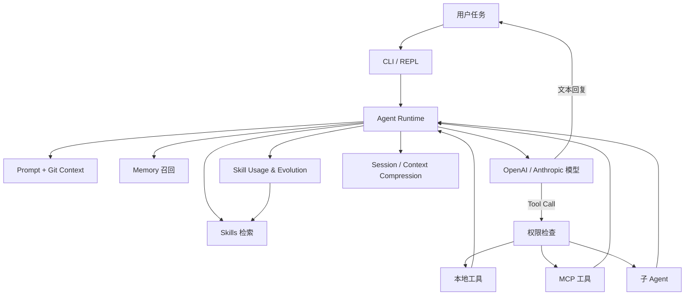

# AxiomWeave

> **AxiomWeave — Self-Evolving Agent Runtime**  
> 一个使用 Python 构建的本地 Agent 运行时，负责统一编排模型推理、工具调用、权限控制、长期记忆、Skills、MCP、子 Agent 与会话上下文。

AxiomWeave 的重点不是封装一次大模型请求，而是实现一套可阅读、可扩展的 **Agent Harness**：模型负责推理并提出工具调用意图，Runtime 负责执行环境操作、回写工具结果、管理上下文，并从用户反馈中沉淀可复用的 Skills。

> [!IMPORTANT]
> AxiomWeave 当前是用于学习、研究和个人开发的实验性项目，尚未达到生产环境所需的安全审计、自动化测试与稳定性标准。

## 核心能力

| 能力 | 说明 |
| --- | --- |
| Agent Loop | 完成模型推理、Tool Call 解析、工具执行、结果回写与继续推理的闭环 |
| 双协议支持 | 支持 OpenAI-compatible 与 Anthropic-compatible API，并提供流式输出 |
| 内置工具 | 支持文件读取、写入、精确编辑、目录浏览、代码搜索与 Shell 命令 |
| 权限模式 | 提供默认确认、自动接受编辑、只读 Plan Mode、自动拒绝和跳过确认等模式 |
| 长期 Memory | 按项目路径隔离记忆，支持记忆索引、相关记忆筛选和异步注入 |
| Skills | 从项目级和用户级 `SKILL.md` 中发现、检索和调用可复用任务方法 |
| Skills 自进化 | 从用户反馈中抽取候选 Skill，并执行 add / merge / discard 与版本审计 |
| MCP | 自研 stdio JSON-RPC MCP Client，将外部 MCP Server 工具接入 Agent |
| 子 Agent | 支持 `explore`、`plan`、`general` 以及自定义子 Agent |
| 上下文管理 | 支持多层上下文压缩、大工具结果持久化、会话保存与恢复 |
| 运行预算 | 支持最大 Agent 轮次和成本预算限制 |

## 设计思路



核心运行链路：

```text
用户输入
  -> 构建 System Prompt、项目上下文与可用工具
  -> 检索相关 Skills，并异步召回长期 Memory
  -> 调用 OpenAI-compatible 或 Anthropic-compatible 模型
  -> 解析文本或 Tool Call
  -> 检查权限并执行本地工具、MCP 或子 Agent
  -> 将 Tool Result 回写模型并继续推理
  -> 保存 Session、统计成本并记录 Skill 使用情况
```

## 项目结构

```text
AxiomWeave/
├── agents/
│   ├── main.py                    # CLI 入口、参数解析和交互式 REPL
│   ├── agent.py                   # Agent Loop、Provider 调用和工具调度
│   ├── tools.py                   # 内置工具、延迟工具与权限系统
│   ├── prompt.py                  # System Prompt 与项目上下文构建
│   ├── memory.py                  # 长期记忆、索引与异步召回
│   ├── skills.py                  # Skill 加载、检索、调用与维护
│   ├── online_skill_evolution.py  # 在线 Skill 抽取和维护决策
│   ├── skill_evolution.py         # Skill 版本、来源和使用记录
│   ├── mcp_client.py              # MCP stdio JSON-RPC Client
│   ├── subagent.py                # 内置与自定义子 Agent
│   ├── session.py                 # 会话保存与恢复
│   ├── frontmatter.py             # Markdown Frontmatter 解析
│   └── ui.py                      # Rich 终端界面
├── .axiomweave/
│   ├── skills/                    # 项目级 Skills
│   └── skill-evolution/           # 本地 Skill 演化与审计数据
├── .mcp.json                      # 项目 MCP Server 配置
├── .env.example                   # 环境变量示例
├── Dockerfile
└── requirements.txt
```

## 环境要求

- Python 3.11+（推荐）
- Git
- 一个 OpenAI-compatible 或 Anthropic-compatible 模型 API
- Node.js / `npx`（仅在使用 Node.js MCP Server 时需要）
- ripgrep（可选，安装后代码搜索体验更好）

## 快速开始

### 1. 创建虚拟环境

```bash
python -m venv .venv
```

Windows PowerShell：

```powershell
.\.venv\Scripts\Activate.ps1
pip install -r requirements.txt
Copy-Item .env.example .env
```

macOS / Linux：

```bash
source .venv/bin/activate
pip install -r requirements.txt
cp .env.example .env
```

### 2. 配置模型

编辑 `.env`，选择一种配置方式。

Anthropic：

```env
ANTHROPIC_API_KEY=sk-ant-your-api-key
ANTHROPIC_BASE_URL=https://api.anthropic.com
AXIOMWEAVE_MODEL=your-anthropic-model
```

OpenAI-compatible：

```env
OPENAI_API_KEY=sk-your-api-key
OPENAI_BASE_URL=https://your-openai-compatible-host/v1
AXIOMWEAVE_MODEL=your-openai-compatible-model
```

通用别名：

```env
APIKEY=sk-your-api-key
API=https://your-provider-endpoint
AXIOMWEAVE_MODEL=your-model
```

协议选择规则：

- API Base URL 路径以 `/anthropic` 结尾或包含 `/anthropic/` 时，使用 Anthropic-compatible 协议。
- 其他显式 API Base URL 默认使用 OpenAI-compatible 协议。
- `--model` 的优先级高于 `AXIOMWEAVE_MODEL` 和 `MODEL`。

> [!WARNING]
> 不要把包含真实密钥的 `.env` 上传到 GitHub。项目已经提供 `.env.example` 用于展示配置格式。

### 3. 启动交互模式

```bash
python -m agents.main
```

### 4. 执行一次性任务

```bash
python -m agents.main "分析这个项目的 Agent Loop"
```

### 5. 使用 Plan Mode

```bash
python -m agents.main --plan "为权限系统重构生成实施计划"
```

## 常用启动参数

| 参数 | 作用 |
| --- | --- |
| `--model`, `-m` | 指定模型名称 |
| `--api-base` | 覆盖环境变量中的 API Base URL |
| `--plan` | 进入只读规划模式 |
| `--accept-edits` | 自动允许文件编辑操作 |
| `--dont-ask` | 自动拒绝需要确认的操作，适合非交互环境 |
| `--yolo`, `-y` | 跳过确认；只应在可信环境中使用 |
| `--thinking` | 为支持的 Anthropic 模型启用扩展思考 |
| `--resume` | 恢复最近一次会话 |
| `--max-cost` | 设置最大成本预算（美元） |
| `--max-turns` | 设置最大 Agent 推理轮次 |

查看完整帮助：

```bash
python -m agents.main --help
```

## REPL 命令

| 命令 | 作用 |
| --- | --- |
| `/clear` | 清空当前对话历史 |
| `/plan` | 切换 Plan Mode |
| `/cost` | 查看 Token 与成本统计 |
| `/compact` | 手动压缩对话上下文 |
| `/memory` | 查看当前项目的长期记忆 |
| `/skills` | 查看已发现的 Skills |
| `/skill-stats` | 查看 Skill 使用与演化统计 |
| `/extract_now [hint]` | 对当前待处理窗口立即执行 Skill 抽取 |
| `/skill-feedback <name> <rating> [note]` | 记录 Skill 使用反馈 |
| `/skill-evolve <name> <lesson>` | 手动演化已有 Skill |
| `/skill-create ...` | 手动创建项目级 Skill |
| `/<skill-name> [args]` | 调用允许用户直接执行的 Skill |

## Skills 与自进化

项目级 Skill 放置在：

```text
.axiomweave/skills/<skill-name>/SKILL.md
```

用户级 Skill 放置在：

```text
~/.axiomweave/skills/<skill-name>/SKILL.md
```

一个最小 Skill 示例：

```markdown
---
name: code-review
description: Review code for correctness, security and maintainability.
context: inline
user-invocable: true
---

Review the target code. Prioritize correctness and security issues, then report
maintainability improvements with concrete file and line references.
```

在线自进化流程：

```text
多轮对话与用户反馈
  -> 提取一个可复用 Skill 候选
  -> 检索相似的已有 Skills
  -> Maintainer 决定 add / merge / discard
  -> 写入或演化 SKILL.md
  -> 记录来源、版本和使用统计
```

默认环境变量：

```env
AXIOMWEAVE_AUTO_SKILL_EVOLUTION=1
AXIOMWEAVE_AUTO_SKILL_TARGET=project
```

这里的“自进化”指反馈驱动的 Skill 生命周期管理，不涉及训练模型或修改模型参数。

## MCP 配置

AxiomWeave 会合并以下位置的 MCP 配置：

1. `~/.axiomweave/settings.json`
2. `<project>/.axiomweave/settings.json`
3. `<project>/.mcp.json`

项目配置示例：

```json
{
  "mcpServers": {
    "context7": {
      "command": "npx",
      "args": ["-y", "@upstash/context7-mcp"]
    },
    "playwright": {
      "command": "npx",
      "args": ["@playwright/mcp@latest"]
    }
  }
}
```

发现的 MCP 工具会以如下形式暴露给模型：

```text
mcp__<server-name>__<tool-name>
```

## 数据目录

运行过程中产生的用户数据默认位于 `~/.axiomweave/`：

```text
~/.axiomweave/
├── sessions/                      # 会话快照
├── plans/                         # Plan Mode 计划文件
├── tool-results/                  # 超大工具结果
├── skills/                        # 用户级 Skills
├── agents/                        # 用户级自定义子 Agent
└── projects/<project-hash>/memory # 按项目隔离的长期记忆
```

## Docker

构建镜像：

```bash
docker build -t axiomweave .
```

在当前项目目录启动：

```bash
docker run --rm -it --env-file .env -v "${PWD}:/workspace" axiomweave
```

Docker 镜像会安装 Chromium 和 Node.js，以支持 Playwright 类 MCP Server，因此首次构建需要一定时间。

## 安全说明

AxiomWeave 能够读取和修改文件、执行 Shell 命令并调用外部 MCP Server。使用时请注意：

- 在不受信任的仓库中避免使用 `--yolo`。
- 执行前检查模型生成的命令和文件修改范围。
- 不要把 API Key、Cookie 或账号凭证写入 Skill、Memory 和仓库文件。
- 建议在容器、临时目录或独立工作区中运行未知任务。
- 当前权限系统仍处于实验阶段，不应视为完整的安全沙箱。

## 当前状态与 Roadmap

已实现：

- [x] OpenAI / Anthropic 双协议流式 Agent Loop
- [x] 内置文件、搜索和 Shell 工具
- [x] 权限模式与 Plan Mode
- [x] 长期 Memory 与相关记忆召回
- [x] Skills 检索、调用、反馈和版本演化
- [x] MCP stdio Client
- [x] 子 Agent、会话恢复和上下文压缩

后续计划：

- [ ] 增加 Agent Loop、权限矩阵、MCP 与 Skills 的自动化测试
- [ ] 接入 CI、类型检查、代码规范和覆盖率报告
- [ ] 完善基于能力的权限模型与子 Agent 权限继承
- [ ] 加强 MCP 超时、进程退出和异常恢复机制
- [ ] 建立可重复运行的 Agent Benchmark 与 Eval 数据集
- [ ] 拆分 Provider、Runtime、Context 和 Permission 模块边界
- [ ] 提供演示视频、运行截图与可复现示例任务

## 项目定位

AxiomWeave 更接近一个 **Agent Runtime / Harness**，而不是面向单一业务场景的 Agent 应用：

```text
Agent 负责思考和选择行动
Runtime 负责承载、约束、执行和记录行动
```

该项目适合用于：

- 学习 Coding Agent 与 Agent Harness 的底层实现
- 研究 Tool Use、Memory、Skills 和上下文工程
- 快速验证领域 Agent 与自定义 MCP 工具
- 作为个人本地 Agent 的二次开发基础

---

如果这个项目对你有帮助，欢迎通过 Issue 分享使用反馈和改进建议。
